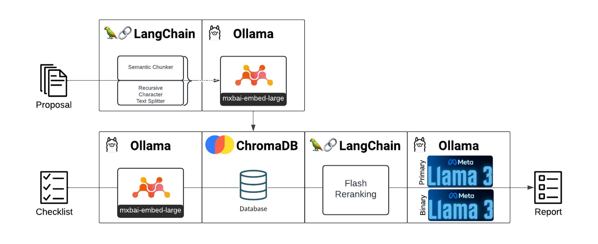
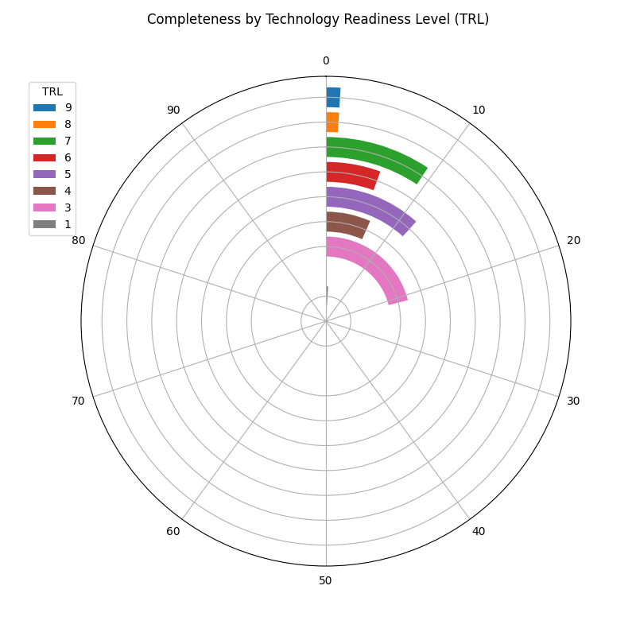
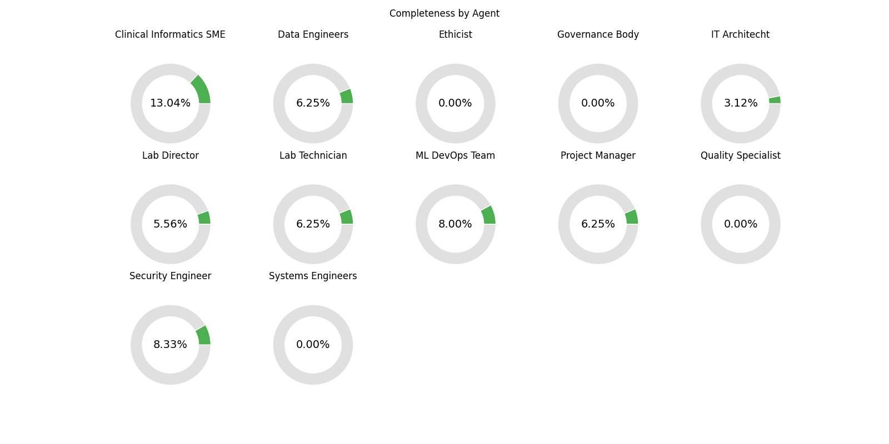

# CARE Automation



The Clinical AI Readiness Evaluator (CARE) process is a structured framework designed to assess and guide the 
development and deployment of AI technologies in clinical settings. It emphasizes the Technology Readiness Levels 
(TRLs), which range from TRL0 (First Principles) to TRL9 (Deployed and Managed). The CARE process ensures that AI 
technologies are robust, safe, ethical, and effective before they are integrated into clinical practice.

The CARE process involves various stakeholder groups, each playing a critical role in the development, validation, and 
deployment of AI technologies in clinical settings. Clinical Informatics SMEs focus on ensuring that AI technologies are 
relevant and seamlessly integrated into clinical workflows, working from identifying clinical needs to supporting 
real-world integration. Data Engineers handle the data aspects, from establishing data requirements to ensuring data 
integration for continuous AI model monitoring. Ethicists oversee the ethical implications at every stage, from defining 
guidelines to ensuring ongoing ethical oversight post-deployment. Governance Bodies ensure regulatory compliance 
throughout the AI lifecycle, from development to deployment.

IT Architects define system requirements and architecture, ensuring the AI system integrates well with existing 
infrastructure and performs optimally. Lab Directors provide oversight for research and development, guiding the project 
from initial research to deployment. Lab Technicians assist with practical implementation, conducting hands-on testing 
and supporting clinical trials. ML DevOps Teams are responsible for setting up development environments, developing, and 
maintaining AI models.

Project Managers coordinate the entire process, managing timelines and ensuring the project stays on track. Quality 
Specialists establish and maintain quality standards, ensuring the AI technology meets rigorous benchmarks throughout 
its lifecycle. Security Engineers focus on implementing and maintaining security measures to protect data and ensure 
compliance with privacy regulations. Finally, Systems Engineers oversee overall system integration, ensuring all 
components work together smoothly and efficiently.

By addressing the specific needs and concerns of each stakeholder group, the CARE process ensures that AI technologies 
are developed responsibly, integrated smoothly into clinical practice, and continually monitored for safety, efficacy, 
and ethical compliance. This comprehensive approach promotes the successful adoption of AI in healthcare, enhancing 
patient outcomes and system efficiency.

# How to use this tool
To use this program, several command line parameters are available:
```shell
usage: main.py [-h] [-p PROPOSAL_FILE_OR_DIR] [-c CARE_FILE] [-d DBFILEPATH] [-o OUT_FILE]
               [-v {DEBUG,INFO,WARNING,CRITICAL}]

CARE AI Lifecycle Assessor

options:
  -h, --help            show this help message and exit
  -p PROPOSAL_FILE_OR_DIR, --proposal_file_or_dir PROPOSAL_FILE_OR_DIR
                        Proposal file or directory.
  -c CARE_FILE, --care_file CARE_FILE
                        CARE Checklist file.
  -d DBFILEPATH, --dbfilepath DBFILEPATH
                        Where to save chromaDB
  -o OUT_FILE, --out_file OUT_FILE
                        Prefix for reports
  -v {DEBUG,INFO,WARNING,CRITICAL}, --verbosity {DEBUG,INFO,WARNING,CRITICAL}
```

## PROPOSAL_FILE_OR_DIR
The PROPOSAL_FILE_OR_DIR option is a simple `.txt` formatted document or it can also be a directory of `.txt`, `docx`, and `pdf`. 
There is some logic derived from the file name that should 
be considered.  If the file name starts with `gs://`, then the file will be downloaded locally before being parsed.

## CARE_FILE
The CARE file should be one of `['.csv', '.xlsx', '.xlsm']`. Like the proposal file, logical parsing of the file 
name dictates whether the file should first be downloaded locally before being integrated into a pandas data frame. 
There are only 3 required columns, but more columns will simply be ignored.
* `TRL`: This is an integer value between 0-9 reflecting the Technology Readiness Level
* `Question`: This is the question to be asked.  It must be in question form - preferably one question per row.
* `Relevant Agents`: This is a comma-separated list of Agents that will be assigned this question.
    > __*Important:*__ The agent name MUST correspond to a set of instructions in the agents folder. The file name is 
  > the 
  > lowercase Agent name with spaces replaced by `_` (example: "Lab Director" should be 
  > "agents/instructions/lab_director.txt") 

An example CARE file is given below.

| TRL	 | Question	                                                                                                                   |Relevant Agents|
|------|-----------------------------------------------------------------------------------------------------------------------------|---------------|
| 1    | Is there evidence of a non-clinical, hypothetical application similar to the intended use?                                  | Lab Director|
| 3    | Does the example data accurately reflect the population of intended use, maintaining similar inclusion/exclusion criteria?  |Clinical Informatics SME, Ethicist|

## DBFILEPATH
This is the path for where to save the chromaDB file. By default, it is `./db`.

## OUT_FILE
The prefix of the file name that will be used to save the 'xlsx' and 'pdf' output files.

## verbosity
Sets the logging level.  `INFO` by default.

# Interpreting the results
There are two main outputs to the CARE automation pipeline: 
* `<report>.xlsx`: The detailed output of the pipeline. Discussed in more detail below.
  * Agent: The Agent who answered the question 
    * e.g. "Ethicist"
  * Q: The question being asked
    * e.g. "Will the plan and documentation be revised accordingly if additional risks are identified in production?"
  * A: The answer provided by the Agent from reviewing the proposal. May be prefaces with "NOT ANSWERED" if 
    the first Agent didn't think the question was answered.
    * e.g. "NOT ANSWERED This passage does not mention anything about revising plans or documentation in response ..." 
  * Binary: A pseudo-binary indicator of whether the question was answered or not. Can be YES, NO, or UNKNOWN.
    * e.g. "NO"
  * Context: The sentences retrieved from the text used to inform the decision. 
    * e.g. "Finally, comprehensive documentation and collaboration are essential. The team should ..."
  * TRL: Technology Readiness Level associated with this question
    * e.g. "9"

* `<report>.pdf`: Graphs and tables summarizing the finding of the Agents.
  * `trl_plot`: Race track plot indicating the completeness by TRL
  
  * `agent_plot`: Donut plot of completion by agent 
  

> Example outputs can be found in the [resources](resources) directory


